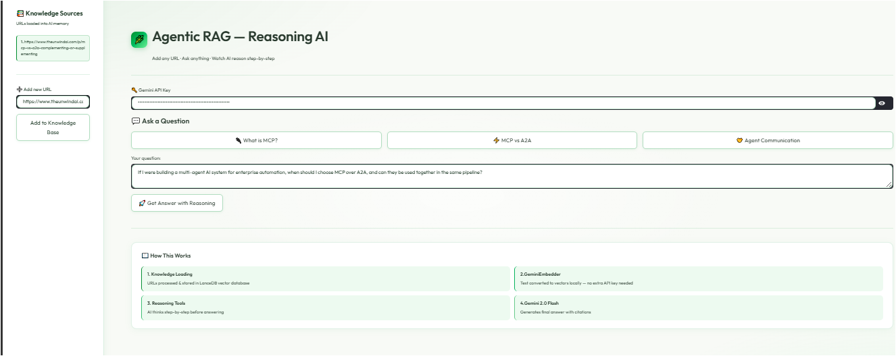
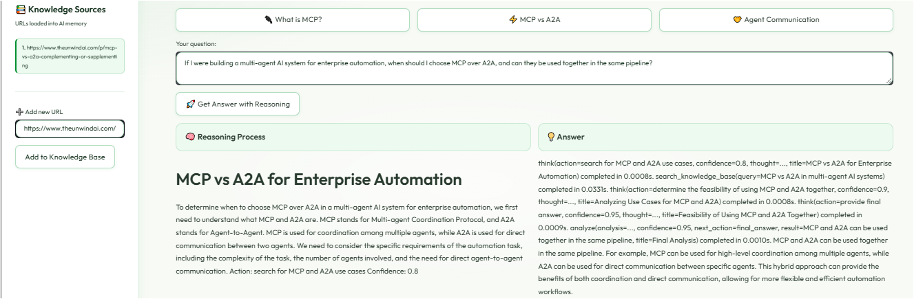

# 🌿 Agentic RAG — Reasoning AI

An AI-powered question-answering app that loads any URL into a knowledge base and answers questions with **step-by-step reasoning**, built with Streamlit, Google Gemini, and LanceDB.

---

## 🚀 Demo




---

## ✨ Features

- 🔗 **Add any URL** — load web articles into AI memory instantly
- 🧠 **Step-by-step reasoning** — watch the AI think before it answers
- 📚 **RAG (Retrieval-Augmented Generation)** — answers grounded in real sources
- ⚡ **Gemini 2.0 Flash** — fast and accurate responses
- 🗄️ **LanceDB vector database** — efficient local storage
- 🔒 **No hardcoded API keys** — secure key input at runtime

---

## 🛠️ Tech Stack

| Technology | Purpose |
|---|---|
| Streamlit | Frontend UI |
| Google Gemini 2.0 Flash | AI language model |
| LanceDB | Vector database |
| FastEmbed | Local text embeddings |
| Agno | AI agent framework |
| Python-dotenv | Environment management |

---

## ⚙️ Installation

### 1. Clone the repository
```bash
git clone https://github.com/Mahrang1/Agentic-RAG-Reasoning-AI.git
cd Agentic-RAG-Reasoning-AI
```

### 2. Install dependencies
```bash
pip install -r requirements.txt
```

### 3. Set up environment variables
```bash
cp .env.example .env
```
Add your Gemini API key in `.env`:
```
GEMINI_API_KEY=your_key_here
```

### 4. Run the app
```bash
streamlit run agentic_rag.py
```

---

## 🔑 Get Your Gemini API Key

Get a free key at [aistudio.google.com/apikey](https://aistudio.google.com/apikey)

---

## 📖 How It Works

1. **Knowledge Loading** — URLs are fetched and stored in LanceDB vector database
2. **FastEmbed Embedder** — text is converted to vectors locally (no extra API key needed)
3. **Reasoning Tools** — AI thinks step-by-step before answering
4. **Gemini 2.0 Flash** — generates final answer with citations

---

## 🗂️ Project Structure

```
Agentic-RAG-Reasoning-AI/
├── agentic_rag.py       # Main application
├── requirements.txt     # Dependencies
├── .env.example         # Environment variables template
├── .gitignore           # Git ignore rules
├── images/              # Project screenshots
└── tmp/                 # LanceDB storage
```

---

## 👩‍💻 Author

**Mahrang Riaz**  
[GitHub](https://github.com/Mahrang1)
